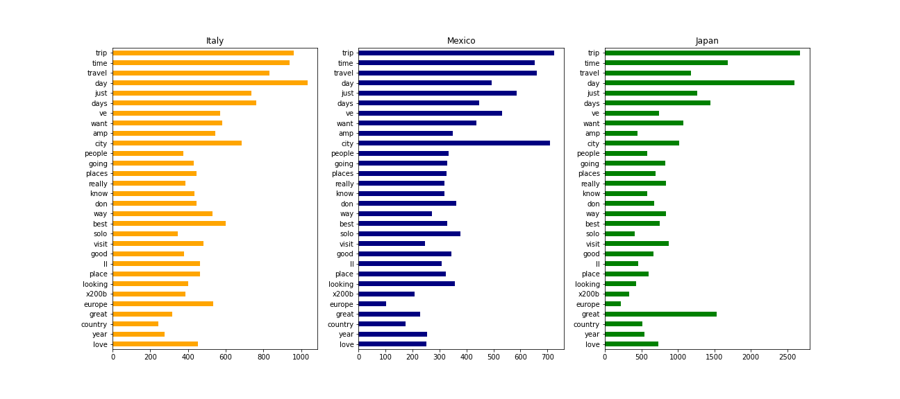
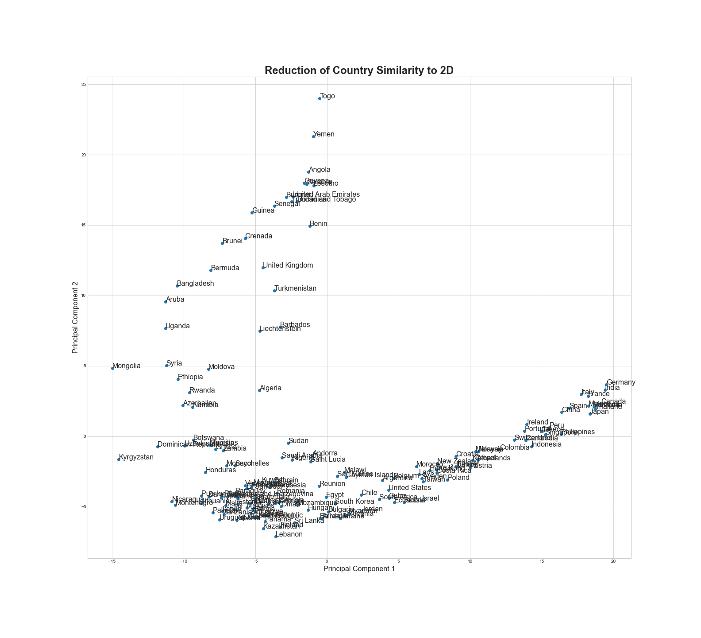
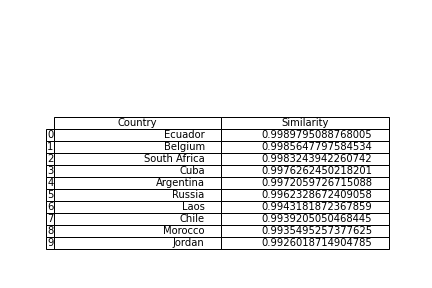

# Building a Travel Recommendation Engine

With around 200 countries in the world, how do I decide on the next one to visit?

Let's build a Recommender System to predict preferred travel destinations for a given user.

Business Cases
- Targeted Advertising on Social Media
- Personal Recommendations on Applications for Travel Agencies

## Data Sources

Travel Blogs:
- FathomAway.com
- TheBlondeAbroad.com
- AmateurTraveler.com
- BeMyTravelMuse.com
- NerdNomads.com
- OrdinaryTraveler.com

Travel Subreddits:
- Travel
- SoloTravel
- Backpacking
- DigitalNomad
- Shoestring
- CampingandHiking
- LongtermTravel
- Wanderlust
- Adventures
- RemotePlaces

I web-scraped filed articles from travel blog articles. I first scraped all filed articled on the FathomAway website via AWS since it combined many articles from a multitude of contributors. Then, I scraped a few of the most popular travel blogs that I found via google search. This process was very time consuming with limited returns on the number of articles, so I decided to supplement these resources with posts from relevant subreddits. I was able to pull thousands of posts very quickly via the [Pushshift Reddit API](https://github.com/pushshift/api).

## Exploratory Data Analysis

After gathering and cleaning the data, I compared the frequently used words across the travel blog articles and travel-related subreddit posts.

## Model the Data

I used [gensim's Doc2Vec](https://radimrehurek.com/gensim/auto_examples/index.html) to train a model on the text from these blogs and articles.

As a result, I was able to provide recommendations of similar countries based on country name or a body of text.

## Conclusions
This is a proof of concept that can generally be applied as a travel recommendation engine, which can provide personalized recommendations to each user. However,  it would be preferred to utilize additional data resources in order to continuously evaluate and improve the model optimization. Furthermore, it would be most beneficial to train this model on specific travel destinations (cities, regions, or excursions). A country in general is too large of a scale to be most useful in providing insights and recommendations.

### Limitations
- No free User input data -- clicks, likes, purchases -- to construct or evaluate the model
- A country is a very large scale

### Future Improvements
- Segment by region or city clusters
- Utilize data directly related to the desired application, including clicks, purchases, and ratings (if available)
- [OPTIONAL] Add weights to more profitable items when providing recommendations
